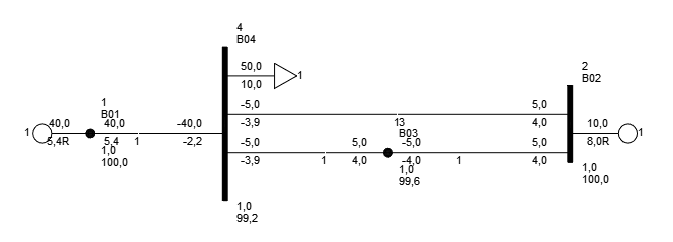
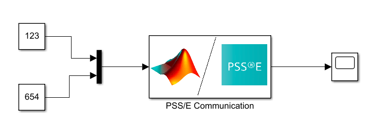
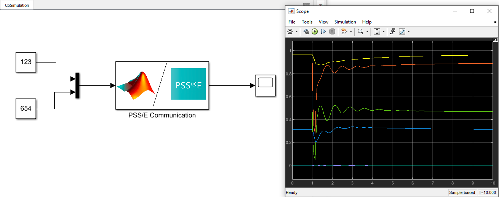
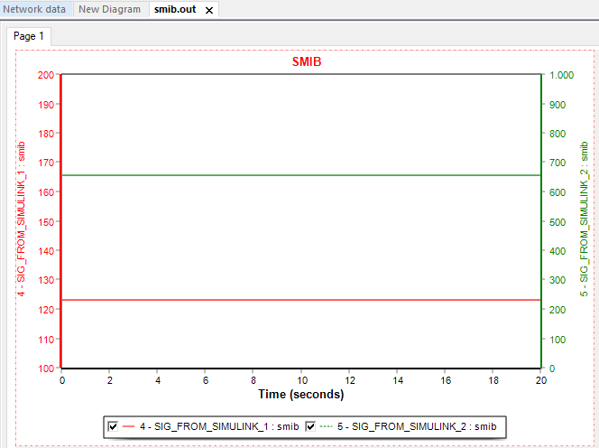

# PSSEComm - PSS/E and Simulink blocks for CoSimulation or Signal Exchange

## Introduction
This project enables the exchange of signals between a Simulink model and the PSS/E simulation. This allows one to:
 - have a model of a controller in Simulink and interface it with the PSS/E thereby speeding-up prototyping and model debugging, or
 - read out the signals from PSS/E during simulation and do processing of those signals on the fly in Simulink

The project consists of two parts, i.e. a MATLAB/Simulink project and the PSS/E part that includes the C++ and Fortran Visual Studio solutions.

## Example
An example of how this project can be used is given in the `test/` folder. A simple single machine infinite bus is simulated shown below:

The goal of the example is to transfer the state variables of the GENROU generator model and receive two dummy signals from Simulink.
The Simulink model is shown here:

As it can be seen, it sends to signals, i.e. numbers 123 and 654 to PSS/E and displays all received signals from PSS/E.

### Simulation Procedure
 1. The simulation must be carried out by first starting the PSS/E simulation by using the script `test/run_smib.py`. PSS/E will then start and wait for the Simulink to start.
 2. When the model in `src\matlab\models\CoSimulation.slx` is ran, both PSS/E and Simulink simulations will continue. 

Once the simulation is executed, it will be possible to observe generator states in the Matlab scope and the two test signals in the PSS/E *.out file.

